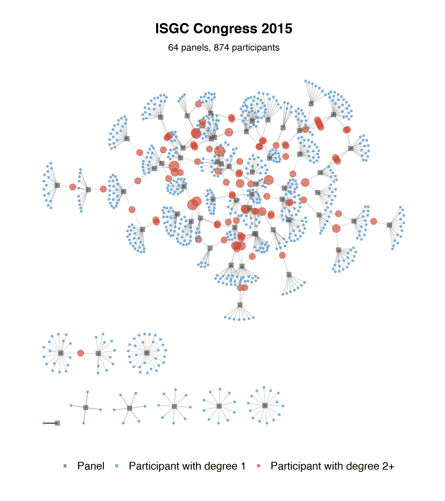
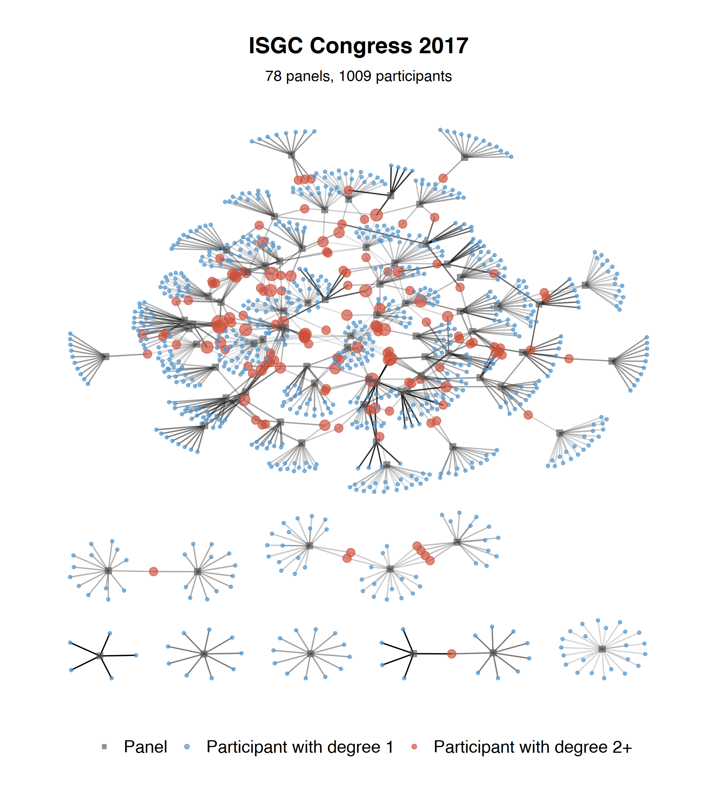
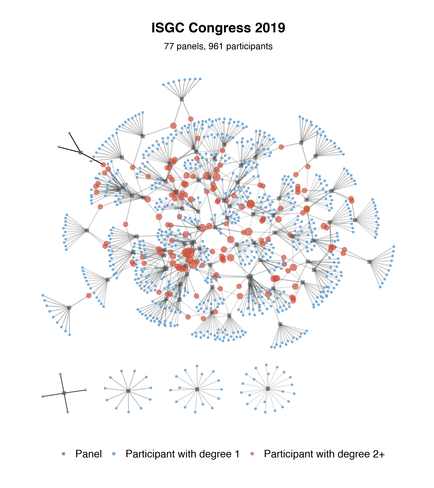
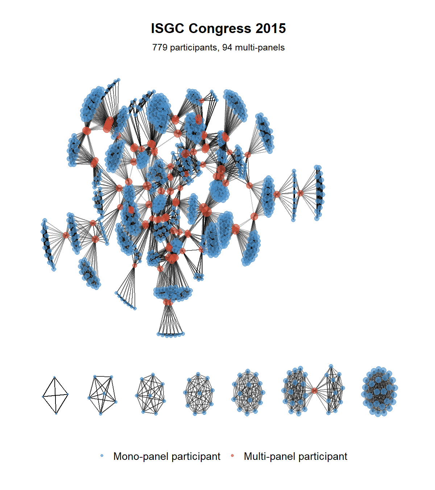

```{r setup, include=FALSE}
knitr::opts_chunk$set(echo = TRUE)
```

## ISGC Congress

```{r , echo = FALSE, message = F, warning = F}

library(tidyverse)
library(kableExtra)
library(ggalluvial)
library(knitr)
library(tnet)
library(igraph)
library(ggraph)
library(RColorBrewer)

abstracts <- read_tsv("data/abstracts-2015-2019.tsv")
authors_abstracts <- read_tsv("data-net/edges-2015-2019.tsv")

```

ISGC is an international conference of green chemistry held every two years in La Rochelle since 2013.
In the frame of the NETCONF research project we focus on several editions of the conference in order to study its structure and dynamics. we are interested in communications, panels, topics, participants and their geographical origin. We consider studying conferences can bring many insights on emergent scientific communities, both regarding their organisation and dynamics.

## Topics

```{r , echo = FALSE, message = F, warning = F}

# keep OC (Oral Communications) and FC (Flash Communications) only
ocfc <- abstracts %>%
  filter(final_status %in% c("OC","FC", "FC - PC", "OC - PC"))

# count number of com per topic
a <- ocfc %>% count(topic_1)

# count number of com per topic per year
# ocfc %>%
  # group_by(year, topic_1) %>%
  # mutate(n_topic = n()) %>%
  # pivot_wider(names_from = year, values_from = n_topic)

# count number of com per topic per year and export this as a table
tab_1 <- ocfc %>%
  group_by(year, topic_1) %>%
  summarise(n = n()) %>%
  mutate(prct = round(n/sum(n)*100, 1)) %>%
  pivot_wider(names_from = year, values_from =  c(n, prct), values_fill = list(n = 0)) %>%
  mutate(total_nb = rowSums(across(starts_with("n")))) %>%
  mutate(total_prct = round(total_nb/sum(total_nb)*100, 1)) %>% 
  mutate(total_prct = replace_na(total_prct, 0),
         prct_2015 = replace_na(prct_2015, 0),
         prct_2017 = replace_na(prct_2017, 0),
         prct_2019 = replace_na(prct_2019, 0))%>% 
  relocate(n_2015, .before = 2) %>%
  relocate(prct_2015, .before = 3) %>%
  relocate(prct_2017, .before = 5) %>%
  relocate(prct_2019, .before = 7) %>%
  arrange(-total_nb)

```

We first look at the topics associated to flash and oral communications given at the ISGC congress over time. We notice that `r tab_1$topic_1[1]` is the more popular topic. It attracted `r tab_1$n_2019[1]` communications at the 2019 edition. However, we notice that certain topics are not represented at every ISGC editions. It is notably the case of `r tab_1$topic_1[1]` which was not present at the 2017 edition. During the 2017 edition, it appears that `r tab_1$topic_1[1]` has been temporarily remplaced by another category named `r tab_1$topic_1[2]` (see Table 1 below).

```{r , echo = FALSE, message = F, warning = F}
tab_1 %>% # add_row = unsatisfying solution
    add_row(topic_1 = "Total", n_2015 = sum(tab_1$n_2015), prct_2015 = round(sum(tab_1$prct_2015), 0), n_2017 = sum(tab_1$n_2017), 
            prct_2017 = round(sum(tab_1$prct_2017), 0), n_2019 = sum(tab_1$n_2019), prct_2019= round(sum(tab_1$prct_2019), 0), 
            total_nb = sum(tab_1$total_nb), total_prct = round(sum(tab_1$total_prct), 0))%>% 
    kbl(col.names = NULL) %>%
    add_header_above(c("ISGC topic", "Nb" = 1, "%" = 1, "Nb" = 1, "%" = 1, "Nb" = 1, "%" = 1, "Nb" = 1, "%" = 1)) %>%
    add_header_above(c(" ", "2015" = 2, "2017" = 2, "2019" = 2, "Total" = 2)) %>%
    add_header_above(c(" ", "Number and % of oral and flash communications" = 8)) %>%
    kable_classic(full_width = F, html_font = "Cambria") %>%
    row_spec(dim(tab_1)[1]+1, bold = T)  %>%  # format last row
    column_spec(c(3, 5, 7, 9), italic = T) # format first column

```

According to François Jérôme, the main organiser of the ISGC conference, it is possible to associate certain similar topics so that we can better analyse trends in the popularity of ISGC topics over time. I refer to François Jérôme's suggestions to decide which topics can be grouped together on the basis of their similarity. Following this operation, we obtain 16 unique topics.

```{r , echo = FALSE, message = F, warning = F}

tab_2 <- tab_1 %>% 
         mutate(topic_1 = recode(topic_1, "Renewable carbon" = "Biomass conversion", 
                "Waste valorization" = "Biomass conversion",
                "Chemical valorization of wastes" = "Biomass conversion",
                "Catalytic systems" = "Homogenous, heterogenous and biocatalysis",
                "Polymers and materials" = "Polymers",
                "Environnemental impact and life cycle assessment" = "Life cycle and environmental assessment",
                "Atom-economy synthesis" = "Clean reactions",
                "Eco-technology" = "New technologies",
                "Alternative technologies" = "New technologies",
                "Non-thermal activation methods" = "New technologies"
                )) %>% 
         group_by(topic_1) %>% 
         summarise(across(where(is.numeric), sum)) %>%
         arrange(-total_nb)

# write_tsv(tab_2, "data/topic.tsv")

allu_1 <- tab_2 %>%
          pivot_longer(starts_with("n_"), names_to = "year", names_prefix = "n_", values_to = "n") %>%
          select(topic_1, year, n)

# svg(file = "plots/topics_ISGC.svg", width = 10, height = 6)

# new plot

# plot.new()

ggplot(allu_1,
       aes(x = year, stratum = topic_1, alluvium = topic_1,
           y = n,
           fill = topic_1, label = topic_1)) +
  scale_x_discrete(expand = c(.1, .1)) +
  geom_flow() +
  geom_stratum(color ="gray65") + #alpha = .5, 
  geom_text(stat = "stratum", size = 3) +
  xlab("ISGC edition") + ylab("Number of oral and flash communications") +
  theme(legend.position = "none", panel.background = element_rect(fill = "white", colour = "lightgrey")) + 
  ggtitle("Number of communications per ISGC topic")

# dev.off()

## alternative alluvial plot (option no 2)
# ggplot(data = allu_1,
 #      aes(x = year, y = n, alluvium = topic_1, label = topic_1)) +
 # geom_alluvium(aes(fill = topic_1, colour = topic_1),
              #  alpha = .75, decreasing = FALSE) +
 # scale_x_discrete(expand = c(.1, .1)) +
 # theme_bw() +
 # theme(axis.text.x = element_text(angle = -30, hjust = 0)) +
  # scale_fill_brewer(type = "qual", palette = "Set3") +
  # scale_color_brewer(type = "qual", palette = "Set3") +
  # facet_wrap(~ region, scales = "fixed") +
 # ggtitle("Number of communications per ISGC topics over time")

```

We observe that 4 topics are present at each edition of the congress: Biomass conversion, Polymers, Alternative solvents, and New technologies. The 8 remaining topics are only present at one or two editions.

## Participation

There are different ways of approaching the conference participation. It can be analysed using registration data or though the lens of communications' authors i.e. active participants. In the latter case, it is possible to filter the information to consider only the active participants who registered to the conference. Indeed, certain communications' co-authors did not attend the conference.

In what follows, we consider the participation through the lens of all communications' authors, whether they registered or not.

```{r , echo = FALSE, message = F, warning = F}
# keeping everyone including industrials and keynote speakers

d <- authors_abstracts  %>%
     mutate(year = as.numeric(year))

# how many participations over the 3 conferences?
t <- group_by(d, i) %>%
  summarise(t_c = n_distinct(year)) %>%
  arrange(-t_c)
```

By counting all the speakers including industrials and keynote speakers over the 3 editions of the congress, we find a total of `r length(t$i)` participants. Among them, `r dim(filter(t, t$t_c %in% 3))[1]` were represented at all editions, `r dim(filter(t, t$t_c %in% 1))[1]` intervened to 1 edition only, (i.e. `r round(dim(filter(t, t$t_c %in% 1))[1]/length(t$i)*100, 2)`%), and `r dim(filter(t, t$t_c %in% 2))[1]` contributed to 2 editions.

```{r , echo = FALSE, message = F, warning = F}

# limiting ourselves to oral communications and flash communications panels
d <- d %>%
  filter(final_status %in% c("OC","FC", "FC - PC", "OC - PC"))

# how many participations to OC and FC over the 3 conferences?
t <- group_by(d, i) %>%
     summarise(t_c = n_distinct(year)) %>%
     arrange(-t_c)

```

If we limit ourselves to participants to oral communications and flash communications panels, we find a total of `r length(t$i)` participants. Among them, `r dim(filter(t, t$t_c %in% 3))[1]` were represented at all editions, `r dim(filter(t, t$t_c %in% 1))[1]` intervened to 1 edition only, (i.e. `r round(dim(filter(t, t$t_c %in% 1))[1]/length(t$i)*100, 2)`%), and `r dim(filter(t, t$t_c %in% 2))[1]` contributed to 2 editions.

```{r , echo = FALSE, message = F, warning = F}
# number of OC and FC panels overall

t <- distinct(d, j, .keep_all = T) %>%
     group_by(year) %>%
     summarise(n = n())

# add number of panels intervention per conference
# (useful for edge weighting)
d <- group_by(d, year, i) %>%
  summarise(n_p = n()) %>%
  inner_join(d, ., by = c("year", "i"))

# add total number of panels and total number of conferences with at least one communication
# (useful for vertex subsetting)
d <- group_by(d, i) %>%
     summarise(t_p = n_distinct(j), t_c = n_distinct(year)) %>%
     inner_join(d, ., by = "i")

```

Overall, there had been `r n_distinct(d$j)` oral and flash communications distinct panels: `r t$n[t$year %in% 2015]` in 2015, `r t$n[t$year %in% 2017]` in 2017, and `r t$n[t$year %in% 2019]` in 2019.

```{r , echo = FALSE, message = F, warning = F}

# nb of authors per paper

nbaut <- d  %>%
  group_by(id, year) %>%
  count(sort = T)

```

In chemistry, most communications are the result of a team work. At ISGC, there is an average of `r round(mean(nbaut$n), 2)` authors per oral and flash communications.

## Networks of panels

In each of the graphs below, the grey dots denote a Congress panel, the blue dots denote participants who attended only one panel, and the red dots denote 'multi-positional' participants who attended more than one Congress panel. Finally, the intensity of the links refers to an inverse weighting that visually accentuates participation in panels with few participants.

Remember that we are counting potential participants here: in practice, some of these participants will not have come to the Congress.

```{r ,  echo = FALSE, message = F, warning = F}

#2m-net participants - panel 2015
 #, dpi = 300

#2m-net participants - panel 2017


#2m-net participants - panel 2019


tab_3 <- readr::read_tsv("data-net/table.tsv") %>%
     relocate(P, .before = 3)  %>%
     mutate(ratio = round(P/P0, 1), .after = P) %>%
     mutate(P1 = round((P1/P*100), 1),
            P2 = round((P2/P*100), 1),
            C = C-1)


```

Are there more and more multi-positional participants - degree 2+ in these bipartite graphs - at the ISGC Congress? The answer is yes, slightly more, which can partly result from the opportunities offered by the increased number of panels. From 2015 to 2017, the number of multi-positional participants increased from `r tab_3$P2[tab_3$year %in% 2015]` to `r tab_3$P2[tab_3$year %in% 2019]`%, i.e. an increase of `r round((tab_3$P2[tab_3$year %in% 2019]-tab_3$P2[tab_3$year %in% 2015])/tab_3$P2[tab_3$year %in% 2015]*100, 2)`%. At the same time, the number of panels increased from `r tab_3$P0[tab_3$year %in% 2015]` to `r tab_3$P0[tab_3$year %in% 2019]`, an increase of `r round((tab_3$P0[tab_3$year %in% 2019]-tab_3$P0[tab_3$year %in% 2015])/tab_3$P0[tab_3$year %in% 2015]*100, 2)`% (see Table 2 below). The number of multi-positional participants thus increased at a highr pace than the number of panels.


```{r, echo = FALSE, message = F, warning = F}

tab_3 %>% 
    kbl(col.names = NULL) %>%
    add_header_above(c("ISGC Congress", "Panels" = 1, "Participants" = 1, "Ratio" = 1, "% degree 1" = 1, "% degree 2+" = 1, "C - 1" = 1)) %>%
    kable_classic(full_width = F, html_font = "Cambria") %>%
    column_spec(c(5, 6), italic = T) # format first column

```

In the table above, the "Ratio" column gives the ratio of participants to panels, which drops very slightly over time. It is difficult to draw a conclusion on the fragmentation of the conference as the number of panels at the ISGC is the result of the organisers' choices when setting up the programme and not of the participants. Indeed, the participants of the ISGC congress choose to associate their paper with a main topic and it is on this basis that the papers are then grouped into panels.

The number of isolated components of the graph, noted as "C - 1" above because only components not connected to the main component have been counted, corresponds to the number of panels in which no participant took part in any other panel of the Congress. This figure is decreasing over time, from `r tab_3$C[tab_3$year %in% 2015]` in 2015 to `r tab_3$C[tab_3$year %in% 2019]` in 2019, i.e. a drop of `r round((tab_3$C[tab_3$year %in% 2015]-tab_3$C[tab_3$year %in% 2019])/tab_3$C[tab_3$year %in% 2015]*100, 2)`%.

In the one-mode networks below, the blue dots indicate participants who attended only one panel of the Congress edition concerned; the red dots indicate participants who attended several panels. 

```{r ,  echo = FALSE, message = F, warning = F}

#2m-net participants - panel 2015
 #, dpi = 300

#2m-net participants - panel 2017


#2m-net participants - panel 2019


```

## Linking communications according to common authors and topics

```{r ,  echo = FALSE, message = F, warning = F}

d <- left_join(d, select(abstracts, Idu, topic_1), by = "Idu" ) %>%
     group_by(Idu) %>%
     mutate(a_id = cur_group_id())  %>% ungroup()

net <- select(d, e = a_id, p = idind)  %>% distinct()

onemode <- projecting_tm(net, method = "sum")

# Transform the result into an igraph object

g <- graph_from_data_frame(cbind(onemode$i, onemode$j), directed = FALSE)

E(g)$weight <- as.double(onemode$w)

# sum(onemode$w)

# Remove multiple lines
g <- simplify(g, remove.multiple = TRUE, edge.attr.comb = c(weight = "first", type = "ignore"))

V(g)$topic <- as.character(d$topic_1[match(V(g)$name, d$a_id)])
V(g)$year <- as.character(d$year[match(V(g)$name, d$a_id)])
V(g)$label <- paste0(V(g)$name, V(g)$year, sep = "_") #
# V(g)$label <- str_trunc(V(g)$topic, 20, "right") # If necessary add "str_to_title"

```

We now consider the network of oral and flash communications sharing one author at least.

```{r ,  echo = FALSE, message = F, warning = F}

# Network plots

colorlist <- c(brewer.pal(9, "Set1")[-6], brewer.pal(8, "Set2")[-7], brewer.pal(12, "Paired")[-11], brewer.pal(12, "Set3")[-c(2, 8, 12)])

# Prepare the historical layout (not legible at the com level) inspired by the histPlot function in the R package {Bibliometrix}

V(g)$size <- 2
g <- delete.vertices(g, degree(g)==0)
dg <- decompose.graph(g)
layout_m <- create_layout(g, layout = "nicely")
layout_m$cluster <- 0
rr <- 0

for (k in 1:length(dg)) {
  bsk <- dg[[k]]
  a <- ifelse(layout_m$name %in% V(bsk)$name, k, 0)
  layout_m$cluster <- layout_m$cluster + a
  Min <- min(layout_m$y[layout_m$cluster == k]) - 1
  layout_m$y[layout_m$cluster == k] <- layout_m$y[layout_m$cluster == k] + (rr - Min)
  rr <- max(layout_m$y[layout_m$cluster == k])
}

bsk <- g
# wp <- membership(cluster_infomap(bsk, modularity = FALSE))
layout_m$x <- layout_m$year

# Historical layout (not legible at the com level)
ghist <- ggraph(layout_m) + 
  geom_edge_arc(width = 1, strength = 0.05, check_overlap = T, edge_alpha = 0.5, color = "grey") + 
  # geom_node_text(aes(label = V(bsk)$id), size = 5, repel = TRUE, color = colorlist[wp], alpha = 0.8) + 
  geom_node_point(size = V(bsk)$size, color = colorlist[as.factor(V(bsk)$topic)], alpha = 0.15) + 
  scale_color_brewer() + 
  scale_x_discrete(labels = as.character(seq(2015, 2019, by = 2)),  expand = c(.1, .1)) + # expand = c(.1, .1)
  theme_minimal() + 
  theme(legend.position = "none", 
                          panel.background = element_rect(fill = "gray97", 
                                                          color = "grey97"), axis.line.y = element_blank(), 
                          axis.text.y = element_blank(), axis.ticks.y = element_blank(), 
                          axis.title.y = element_blank(), axis.title.x = element_blank(), 
                          panel.grid.minor.y = element_blank(), panel.grid.major.y = element_blank(), 
                          panel.grid.minor.x = element_blank(), axis.text.x = element_text(face = "bold", 
                                                                                           angle = 90, size = 6)) + labs(title = "Historical layout")
# plot(ghist)

plot(g, vertex.label = NA)

```

It counts `r length(V(g))` communications, among which `r length(V(g)[year == "2015"])` from the 2015 edition, `r length(V(g)[year == "2017"])` from the 2017 edition, and `r length(V(g)[year == "2019"])` from the 2019 edition.
