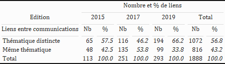
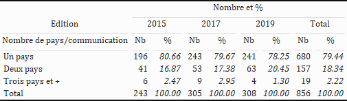
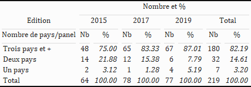
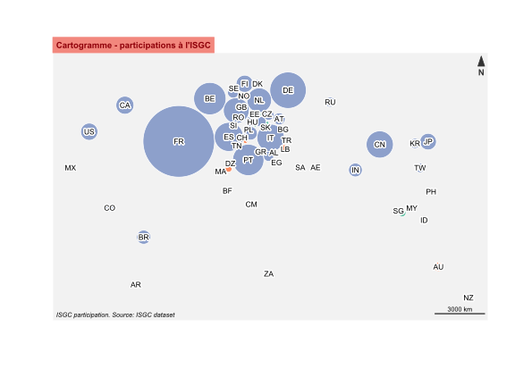

```{r setup, include=FALSE}
knitr::opts_chunk$set(echo = TRUE)
```

## Statistiques complémentaires et analyses en vue de la JE NETCONF

Document de travail en français sur les données ISGC.

```{r ,  echo = FALSE, message = F, warning = F}

# Chargement des packages

library(tidyverse)
library(cartigraph)
library(igraph)
library(kableExtra) # package permettant de mettre en forme des tableaux au format image
library(magick) # package nécessaire au bon fonctionnement de kableExtra

```

```{r ,  echo = FALSE, message = F, warning = F}

# Chargement des données 

abstracts <- read_tsv("data/abstracts-2015-2019.tsv")
authors_abstracts <- read_tsv("data-net/edges-2015-2019.tsv")

d <- authors_abstracts  %>%
  mutate(year = as.numeric(year)) %>%
  filter(final_status %in% c("OC","FC", "FC - PC", "OC - PC")) %>%
  left_join(select(abstracts, Idu, topic_1), by = "Idu" ) %>%
     group_by(Idu) %>%
     mutate(a_id = cur_group_id())  %>% ungroup()  %>% 
     mutate(rtopic = recode(topic_1, "Renewable carbon" = "Biomass conversion", 
                "Waste valorization" = "Biomass conversion",
                "Chemical valorization of wastes" = "Biomass conversion",
                "Catalytic systems" = "Homogenous, heterogenous and biocatalysis",
                "Polymers and materials" = "Polymers",
                "Environnemental impact and life cycle assessment" = "Life cycle and environmental assessment",
                "Atom-economy synthesis" = "Clean reactions",
                "Eco-technology" = "New technologies",
                "Alternative technologies" = "New technologies",
                "Non-thermal activation methods" = "New technologies"
                ))
  

```

Extraire le réseau des communications ayant au moins 1 auteur en commun

```{r ,  echo = FALSE, message = F, warning = F}

# network of Oral and flash communications with at least one common author

net <- select(d, p = a_id, e = i)  %>% distinct()
  
# From 2-mode to 1-mode, this function transform the result into an igraph object
g <- cartigraph::netproj(net, method = "sum")

V(g)$topic <- as.character(d$topic_1[match(V(g)$name, d$a_id)])
V(g)$rtopic <- as.character(d$rtopic[match(V(g)$name, d$a_id)])
V(g)$year <- as.character(d$year[match(V(g)$name, d$a_id)])
V(g)$label <- paste0(V(g)$name, V(g)$year, sep = "_") #
# V(g)$label <- str_trunc(V(g)$topic, 20, "right") # If necessary add "str_to_title"

```


1. Calculer la part des liens intra-topic vs la part des liens inter-topic au niveau du réseau de communications

```{r, echo = FALSE, message = F, warning = F}

# Keep only the links between communications with different topics
# inspired by https://stackoverflow.com/questions/60279825/calculating-network-statistics-between-attribute-classes-with-igraph-in-r

vattrs <- igraph::vertex_attr(g, name = "rtopic")
total_el <- igraph::as_edgelist(g, names = FALSE)

# rows from total_el where the attribute of the edge source == attribute of edge target
edges_to_rm <- vattrs[total_el[, 1L]] == vattrs[total_el[, 2L]]

t <- as_tibble(edges_to_rm) %>%
  count(value) %>%
  mutate(prct = round(n/sum(n)*100, 1)) %>% # ajouter une colonne avec le % d'articles par langue à chaque période
  mutate(value = ifelse(value == TRUE, "Même thématique", "Thématique distincte")) %>%
  add_row(summarise(., # ajouter les totaux par colonne
                      across(where(is.numeric), sum), # faire le total pour les colonnes numériques
                      across(where(is.character), ~"Total")))

# heterophilic communication network in terms of topics
gh <- subgraph.edges(g, eids = which(!edges_to_rm), delete.vertices = T)


# subgraphs by year - planning to try tidygraph to improve what follows in the near future

g1 <- induced_subgraph(g, vids = which(V(g)$year == 2015))
g2 <- induced_subgraph(g, vids = which(V(g)$year == 2017))
g3 <- induced_subgraph(g, vids = which(V(g)$year == 2019))

# 2015

vattrs <- igraph::vertex_attr(g1, name = "rtopic")
total_el <- igraph::as_edgelist(g1, names = FALSE)

# rows from total_el where the attribute of the edge source == attribute of edge target
edges_to_rm1 <- vattrs[total_el[, 1L]] == vattrs[total_el[, 2L]]

t1 <- as_tibble(edges_to_rm1) %>%
  count(value) %>%
  mutate(prct = round(n/sum(n)*100, 1)) %>% # ajouter une colonne avec le % d'articles par langue à chaque période
  mutate(value = ifelse(value == TRUE, "Même thématique", "Thématique distincte")) %>%
  add_row(summarise(., # ajouter les totaux par colonne
                      across(where(is.numeric), sum), # faire le total pour les colonnes numériques
                      across(where(is.character), ~"Total")))

# 2017

vattrs <- igraph::vertex_attr(g2, name = "rtopic")
total_el <- igraph::as_edgelist(g2, names = FALSE)

# rows from total_el where the attribute of the edge source == attribute of edge target
edges_to_rm2 <- vattrs[total_el[, 1L]] == vattrs[total_el[, 2L]]

t2 <- as_tibble(edges_to_rm2) %>%
  count(value) %>%
  mutate(prct = round(n/sum(n)*100, 1)) %>% # ajouter une colonne avec le % d'articles par langue à chaque période
  mutate(value = ifelse(value == TRUE, "Même thématique", "Thématique distincte")) %>%
  add_row(summarise(., # ajouter les totaux par colonne
                      across(where(is.numeric), sum), # faire le total pour les colonnes numériques
                      across(where(is.character), ~"Total")))

# 2019

vattrs <- igraph::vertex_attr(g3, name = "rtopic")
total_el <- igraph::as_edgelist(g3, names = FALSE)

# rows from total_el where the attribute of the edge source == attribute of edge target
edges_to_rm3 <- vattrs[total_el[, 1L]] == vattrs[total_el[, 2L]]

t3 <- as_tibble(edges_to_rm3) %>%
  count(value) %>%
  mutate(prct = round(n/sum(n)*100, 1)) %>% # ajouter une colonne avec le % d'articles par langue à chaque période
  mutate(value = ifelse(value == TRUE, "Même thématique", "Thématique distincte")) %>%
  add_row(summarise(., # ajouter les totaux par colonne
                      across(where(is.numeric), sum), # faire le total pour les colonnes numériques
                      across(where(is.character), ~"Total")))


# Tableau recap

bind_cols(t1, t2[,-1], t3[,-1], t[,-1]) %>%
  kbl(col.names = NULL) %>% # représenter le contenu du tableau sauf les entêtes de colonnes
  # ajouter une première entête de colonne pour chacune des 9 colonnes du tableau
  add_header_above(c("Liens entre communications", rep(c("Nb", "%"), 4))) %>%
  # ajouter une seconde entête surplombant la première, indiquant les 3 périodes et la partie Total
  add_header_above(c("Edition", "2015" = 2, "2017" = 2, "2019" = 2, "Total" = 2)) %>%
  # ajouter une troisième entête générale précisant le contenu d'ensemble du tableau
  add_header_above(c(" ", "Nombre et % de liens" = 8)) %>%
  kable_classic(full_width = F, html_font = "Cambria") %>% # choisir l'apparence du tableau et la police
  row_spec(dim(.)[1]+1, bold = T)  %>%  # mettre en gras la dernière ligne (totaux en ligne)
  column_spec(c(3, 5, 7, 9), italic = T) # %>% # mettre en italique les colonnes contenant les %
  # save_kable(paste("plots/reseaux_thematiques.png")) # exporter et sauvegarder la figure au format image

#  # afficher la figure
  

```


2. Calculer la part des communications à 1 pays, à 2 pays, à 2 pays et plus sur l'ensemble des coms

```{r ,  echo = FALSE, message = F, warning = F}

recipe <- read_tsv("data/geonames-recipe-countries.tsv")


countrydf <- "data/missing_country.tsv"

if (!file.exists(countrydf)) {
  
d %>%
  mutate(country = str_to_upper(country)) %>%
  left_join(recipe, by = c("country" = "country_src")) %>%
  filter(is.na(country_dest)) %>%
  distinct(a_id, institution, country_dest) %>%
  write_tsv(countrydf)
}

d <- d %>%
  left_join(read_tsv(countrydf), 
            by = c("institution", "a_id", "country")) %>%
  mutate(country = str_to_upper(country)) %>%
  left_join(select(recipe, -ISO2_dest), by = c("country" = "country_src")) %>%
  mutate(country_dest = coalesce(country_dest.x, country_dest.y)) %>%
  select(-c(country_dest.x, country_dest.y))

nb_pays <- d %>%
  distinct(a_id, country_dest) %>%
  count(a_id) %>%
  mutate(var = ifelse(n == 1, "Un pays", 
                      ifelse(n == 2, "Deux pays", "Trois pays et +"))) %>%
  count(var) %>%
  arrange(-n)

d %>%
  distinct(year, a_id) %>%
  count(year)

subset <- d %>%
  filter(year == "2015") %>%
  distinct(a_id, country_dest, year) %>%
  count(a_id, year) %>% 
  mutate(var = ifelse(n == 1, "Un pays", 
                      ifelse(n == 2, "Deux pays", "Trois pays et +"))) %>%
  group_by(var) %>%
  summarise(n = n()) %>% 
  mutate(prct = round(n/sum(n)*100, 1)) 
  

nb_pays_an <- d %>%
  distinct(a_id, country_dest, year) %>%
  count(a_id, year) %>% 
  mutate(var = ifelse(n == 1, "Un pays", 
                      ifelse(n == 2, "Deux pays", "Trois pays et +"))) %>% 
  group_by(var, year) %>%
  summarise(n = n()) %>% 
  ungroup() %>%
  group_by(year) %>%
  mutate(prct = round(n/sum(n)*100, 2)) %>% # ajouter une colonne avec le % d'articles par type à chaque période
  ungroup() %>%
  arrange(year, -n) %>%
  pivot_wider(names_from = year, values_from = c(n, prct)) %>% # transposer le tableau en largeur
  mutate(across(everything(), ~replace_na(.x, 0))) %>% # remplacer les valeurs manquantes par des zeros
  mutate(total_nb = rowSums(across(starts_with("n")))) %>% # ajouter une colonne avec le total des 3 périodes
  mutate(total_prct = round(total_nb/sum(total_nb)*100, 2)) %>% # ajouter une colonne avec le % du total
  relocate(prct_2015, .before = 3) %>% # modifier la position de la colonne prct_p1
  relocate(prct_2017, .before = 5) %>%
  add_row(summarise(., # ajouter les totaux par colonne
                      across(where(is.numeric), sum), # faire le total pour les colonnes numériques
                      across(where(is.character), ~"Total")) %>% # écrire "Total" dans la première colonne
              mutate(across(starts_with("prct_"), round, 0))) # modifier la position de la colonne prct_p2


nb_pays_an %>%
  kbl(col.names = NULL) %>% # représenter le contenu du tableau sauf les entêtes de colonnes
  # ajouter une première entête de colonne pour chacune des 9 colonnes du tableau
  add_header_above(c("Nombre de pays/communication", rep(c("Nb", "%"), 4))) %>%
  # ajouter une seconde entête surplombant la première, indiquant les 3 périodes et la partie Total
  add_header_above(c("Edition", "2015" = 2, "2017" = 2, "2019" = 2, "Total" = 2)) %>%
  # ajouter une troisième entête générale précisant le contenu d'ensemble du tableau
  add_header_above(c(" ", "Nombre et %" = 8)) %>%
  kable_classic(full_width = F, html_font = "Cambria") %>% # choisir l'apparence du tableau et la police
  row_spec(dim(.)[1]+1, bold = T)  %>%  # mettre en gras la dernière ligne (totaux en ligne)
  column_spec(c(3, 5, 7, 9), italic = T) # %>% # mettre en italique les colonnes contenant les %
  # save_kable(paste("plots/internationalisation_com.png")) # exporter et sauvegarder la figure au format image

#  # afficher la figure
  

```
3. Calculer la part des panels à 1 pays, à 2 pays, à 2 pays et plus sur l'ensemble des panels

```{r ,  echo = FALSE, message = F, warning = F}

nb_pays_an <- d %>%
  distinct(j, country_dest, year) %>%
  count(j, year) %>% 
  mutate(var = ifelse(n == 1, "Un pays", 
                      ifelse(n == 2, "Deux pays", "Trois pays et +"))) %>% 
  group_by(var, year) %>%
  summarise(n = n()) %>% 
  ungroup() %>%
  group_by(year) %>%
  mutate(prct = round(n/sum(n)*100, 2)) %>% # ajouter une colonne avec le % d'articles par type à chaque période
  ungroup() %>%
  arrange(year, -n) %>%
  pivot_wider(names_from = year, values_from = c(n, prct)) %>% # transposer le tableau en largeur
  mutate(across(everything(), ~replace_na(.x, 0))) %>% # remplacer les valeurs manquantes par des zeros
  mutate(total_nb = rowSums(across(starts_with("n")))) %>% # ajouter une colonne avec le total des 3 périodes
  mutate(total_prct = round(total_nb/sum(total_nb)*100, 2)) %>% # ajouter une colonne avec le % du total
  relocate(prct_2015, .before = 3) %>% # modifier la position de la colonne prct_p1
  relocate(prct_2017, .before = 5) %>%
  add_row(summarise(., # ajouter les totaux par colonne
                      across(where(is.numeric), sum), # faire le total pour les colonnes numériques
                      across(where(is.character), ~"Total")) %>% # écrire "Total" dans la première colonne
              mutate(across(starts_with("prct_"), round, 0))) # modifier la position de la colonne prct_p2


nb_pays_an %>%
  kbl(col.names = NULL) %>% # représenter le contenu du tableau sauf les entêtes de colonnes
  # ajouter une première entête de colonne pour chacune des 9 colonnes du tableau
  add_header_above(c("Nombre de pays/panel", rep(c("Nb", "%"), 4))) %>%
  # ajouter une seconde entête surplombant la première, indiquant les 3 périodes et la partie Total
  add_header_above(c("Edition", "2015" = 2, "2017" = 2, "2019" = 2, "Total" = 2)) %>%
  # ajouter une troisième entête générale précisant le contenu d'ensemble du tableau
  add_header_above(c(" ", "Nombre et %" = 8)) %>%
  kable_classic(full_width = F, html_font = "Cambria") %>% # choisir l'apparence du tableau et la police
  row_spec(dim(.)[1]+1, bold = T)  %>%  # mettre en gras la dernière ligne (totaux en ligne)
  column_spec(c(3, 5, 7, 9), italic = T) # %>% # mettre en italique les colonnes contenant les %
  # save_kable(paste("plots/internationalisation_panel.png")) # exporter et sauvegarder la figure au format image

#  # afficher la figure


```

4. Calculer la part des panels à 1 pays, à 2 pays, à 2 pays et plus sur l'ensemble des panels par topic

```{r ,  echo = FALSE, message = F, warning = F}
nb_pays_an_topic <- d %>%
  distinct(j, country_dest, year, rtopic) %>%
  count(j, year, rtopic) %>% 
  mutate(var = ifelse(n == 1, "Un pays", 
                      ifelse(n == 2, "Deux pays", "Trois pays et +"))) %>% 
  group_by(var, year, rtopic) %>%
  summarise(n = n()) %>% 
  ungroup() %>%
  group_by(year) %>%
  mutate(prct = round(n/sum(n)*100, 2)) %>% # ajouter une colonne avec le % d'articles par type à chaque période
  arrange(year, -n) %>%
  pivot_wider(names_from = year, values_from = c(n, prct)) %>% # transposer le tableau en largeur
  mutate(across(everything(), ~replace_na(.x, 0))) # %>% # remplacer les valeurs manquantes par des zeros
 # split(list(.$rtopic)) %>% # séparer le résultat en 16 tableaux distincts
 # bind_cols %>%
 # mutate(total_nb = rowSums(across(starts_with("n")))) %>% # ajouter une colonne avec le total des 3 périodes
 # mutate(total_prct = round(total_nb/sum(total_nb)*100, 2)) %>% # ajouter une colonne avec le % du total
 # relocate(prct_2015, .before = 3) %>% # modifier la position de la colonne prct_p1
 # relocate(prct_2017, .before = 5) %>%
 # add_row(summarise(., # ajouter les totaux par colonne
                    #  across(where(is.numeric), sum), # faire le total pour les colonnes numériques
                    #  across(where(is.character), ~"Total")) %>% # écrire "Total" dans la première colonne
            #  mutate(across(starts_with("prct_"), round, 0))) # modifier la position de la colonne prct_p2
```

#### Présence des pays

Nombre de pays distincts ayant participé à l'ISGC :

```{r ,  echo = FALSE, message = F, warning = F}

# Liste des pays venus 1 seule fois, 2 fois, et 3 fois

freq_pays <- d %>%
  distinct(country_dest, year) %>%
  count(country_dest) %>%
  split(list(.$n))

# Liste des pays venus 1 fois
freq1 <- freq_pays [[1]][1]

# Liste des pays venus 2 fois
freq2 <- freq_pays [[2]][1]

# Liste des pays venus 3 fois
freq3 <- freq_pays [[3]][1]

d %>%
  distinct(country_dest) %>%
  nrow(.)

# 42 pays en 2015, 38 en 2017 et 40 en 2019... Total de 53 pays distincts
evol_pays <- d %>%
  distinct(country_dest, year) %>%
  count(year)

evol_pays

```


### cartogramme - taille du pays proportionnelle au nombre fractionné de communications du pays

```{r ,  echo = FALSE, message = F, warning = F}

freq_pays <- d %>%
  distinct(country_dest, year) %>%
  count(country_dest) %>%
  mutate(freq = as.factor(n)) %>%
  dplyr::select(-n)

prepcarto <- d %>%
  distinct(country_dest, a_id) %>%
  group_by(a_id) %>%
  mutate(frac = 1/n()) %>%
  ungroup() %>%
  group_by(country_dest) %>%
  summarise(n = sum(frac)) %>%
  left_join(dplyr::select(recipe, -country_src)) %>%
  distinct() %>%
  filter(!ISO2_dest %in% "KP") %>%
  left_join(freq_pays)


  

```
# Cartographie

```{r ,  echo = FALSE, message = F, warning = F}

library(cartography)
library(cartogram)

# Get the shape file of the world
library(maptools)
data(wrld_simpl)

prepcarto$n <- prepcarto$n*10

wrld_simpl@data$ISGC <- prepcarto$n[match(wrld_simpl@data$ISO2, prepcarto$ISO2_dest)]
wrld_simpl@data$freq <- prepcarto$freq[match(wrld_simpl@data$ISO2, prepcarto$ISO2_dest)]

wrld_simpl@data$ISGC <- ifelse(is.na(wrld_simpl@data$ISGC), 0, wrld_simpl@data$ISGC)

wrld_simpl <- spTransform(wrld_simpl[wrld_simpl$ISGC > 0,], "+proj=moll") # if spTransform does not work, use sf::st_transform

wrld_dorling <- cartogram_dorling(wrld_simpl, "ISGC")

colrs <- RColorBrewer::brewer.pal(3, "Set2")

# svg(paste("plots/cartogram.svg"), width = 8, height = 6)

#   plot.new()
#   plot(wrld_dorling, col= colrs[wrld_dorling@data$freq], border ="white", bg = "grey95")

#cartography::layoutLayer(title = "Cartogramme - participations à l'ISGC, aux 3 éditions", 
#            sources = "", north = TRUE, tabtitle = TRUE,
#            theme = "red.pal", frame = FALSE,  
#            author = "ISGC participation. Source: ISGC dataset")

#cartography::labelLayer(x = wrld_dorling, txt = "ISO2", overlap = FALSE, show.lines = FALSE, 
#           halo = TRUE, r = .15)

# dev.off()

 # afficher la figure

```

